# 🍽️ Planny Planny

**Did Planny Planny help?** Every other feature in this app exists in service of one question: *did the meal we planned actually get cooked and eaten?* Outcomes (✅ as planned, or — and *why*) are the headline metric — recorded per meal, displayed on every card, aggregated globally on the welcome screen, and the single yardstick we measure new features against.

**Perpetual food planning for healthy families.**

Meal planning is hard and easily neglected — it's too easy to skip it and order takeaway instead. Planny Planny helps families collaboratively plan meals, track ingredients for balanced nutrition, adapt to real life (visitors, events, busy weeks), and — crucially — record whether the plan actually happened so the household learns over time.

## ✨ Features

- **Outcomes — the headline metric** — Tap a meal on today (or any past day) and tell Planny Planny how it went: ✅ "as planned" or — with a one-tap reason ("we didn't shop", "ate out", "unexpected event", "didn't fancy it", or "other" with a note). Every meal card flips into a happy 🌱 emerald state on success or a quiet neutral state with the reason on a miss. Yesterday's meals appear as a **ghost row** at the top of the calendar until each one has an outcome — a gentle, dismissible nudge rather than a notification. The **welcome screen** shows the total count of "as planned" meals across every household using the app: *"Successfully helped families plan N meals."* The number is cached daily (and lazily refreshed on first read) so anonymous visitors see it instantly. Outcomes can only be recorded by editors (owner / member / honoured guest) — voting guests and public viewers can see the result but not change it. See [`docs/outcomes.md`](docs/outcomes.md) for the full design.
- **Perpetual Calendar** — A scrolling, mobile-first calendar starting from today. See your meal plan at a glance, plan as far ahead as you like. Your scroll position is remembered when you dip into a day, and a "Return to today" button appears once you've scrolled far ahead so you can jump straight back.
- **Swipe Between Days** — On the day view, swipe left for the next day and right for the previous day, with a smooth slide transition. Swiping a meal card scrolls between meals on the same day instead of changing the day.
- **Collaborative Households** — Create a household, invite your partner or family. Both can add and edit meals. Changes appear instantly via WebSockets.
- **Smart Context** — Each day shows how many adults and children you're cooking for. Add events like "Mum visiting" to adjust the count.
- **Day Placeholders** — Set themes for each day of the week: "Oily Fish Monday", "Veggie Thursday", "Sunday Roast".
- **Ingredient Tracking** — Tag meals with ingredients. Star your favourites. Get reminders when you haven't used a starred ingredient in a while.
- **Ingredient Warnings** — Mark ingredients that you overuse (hello, chicken!). Get prompted when you've already had it in the last 7 days.
- **Public Sharing** — Share a read-only link to your meal plan so visiting family can see what's for dinner, including meal ideas with vote counts (no events, no voter names).
- **Multiple Households** — Belong to multiple households (e.g., your family + a shared flat). Switch between them easily, see every membership in one place, and leave when you no longer want to be in one. The app remembers the last household you were using **on your account, not just your device**, so you drop straight back into it on the next sign-in from anywhere (with a fall-back to another of your households if you're no longer a member).
- **Subtle Sound Effects** — Friendly little Web Audio chimes when meals or todos arrive, when reactions land, when you tick a task off, when you record a successful outcome (the celebratory `done` chime), and as you swipe between days (in time with the slide animation). On by default; if you find them distracting you can switch them off in Settings → Preferences and the choice follows you across devices.
- **Five Access Levels** — Owner, Member, Honoured Guest (full editor, can't invite), Voting Guest (vote only), and Public. Each role's capabilities — including who can record outcomes — are summarised in an in-app "What do these levels mean?" tray and documented in [`docs/permissions.md`](docs/permissions.md).
- **Per-email Invites** — Owners and members invite people by email. The invite link only works for that address and is consumed automatically when the person joins.
- **Meal Ideas, Meals & Reactions** — Add lightweight meal ideas per day and react to ideas or meal plans with 👍. Tap the reaction button to like/unlike; long press to see who reacted.
- **AI Meal Suggestions (Magic Wand)** — Generate a tailored prompt to paste into ChatGPT. Pulls in household headcount, events, day theme, suggested ingredients, and household meal ideas. Choose to exclude ideas, include all, or only thumbed-up ones — multiple thumbs-up ideas ask the AI for three recipes per idea.
- **ChatGPT Plugin** — Connect Planny Planny directly to ChatGPT as a Custom Action. Ask "What's for dinner this week?", "Add a todo to buy milk", "Mark last night's curry as done", "What do we need to shop for?" — everything you can do in the app, conversationally. Full setup guide in [`docs/chatgpt-plugin.md`](docs/chatgpt-plugin.md).

## 🏗️ Tech Stack

| Layer | Technology |
|---|---|
| Frontend | React 19 + Vite + TypeScript |
| Styling | Tailwind CSS (mobile-first) |
| Backend | Supabase (Postgres, Auth, Realtime, RLS) |
| State | TanStack Query + Supabase Realtime (WebSockets) |
| Routing | React Router v7 |
| Unit Testing | Vitest + React Testing Library |
| E2E Testing | Playwright + playwright-bdd (Gherkin BDD) |
| CI/CD | GitHub Actions |

## 📱 Screenshots & User Journeys

### 1. Sign Up & Sign In

New users create an account with a display name, email, and password. A personal household is automatically created for them.

<p align="center">
  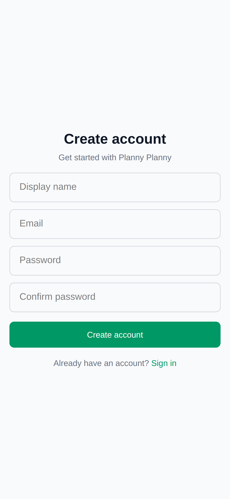
  &nbsp;&nbsp;
  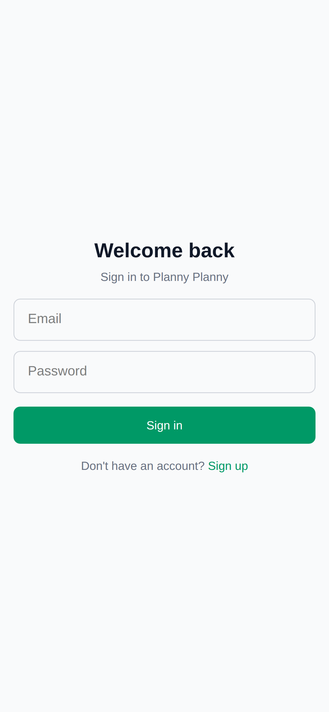
</p>

<details>
<summary>Desktop view</summary>
<p align="center">
  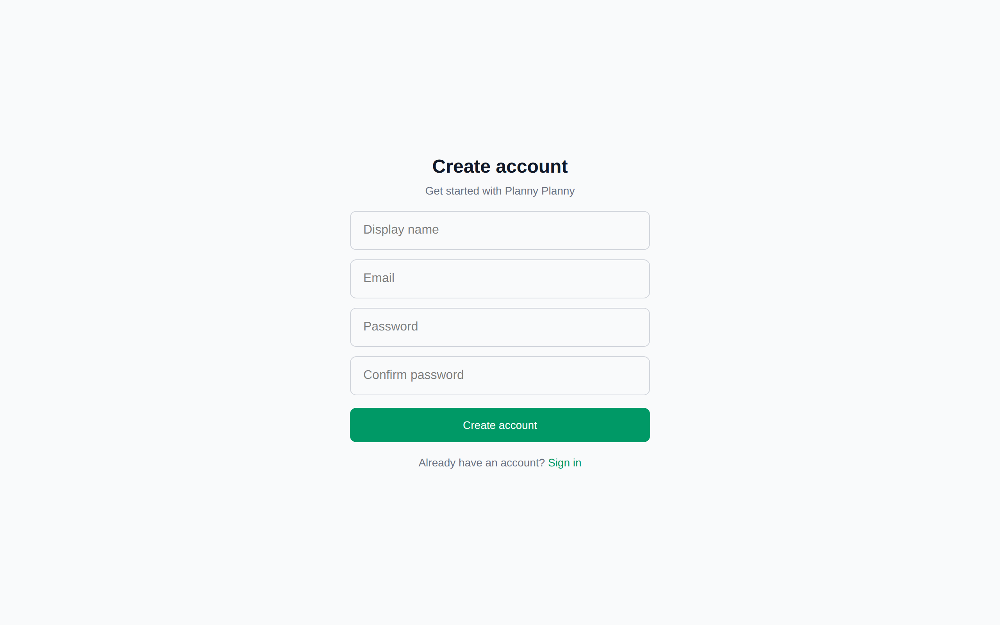
</p>
<p align="center">
  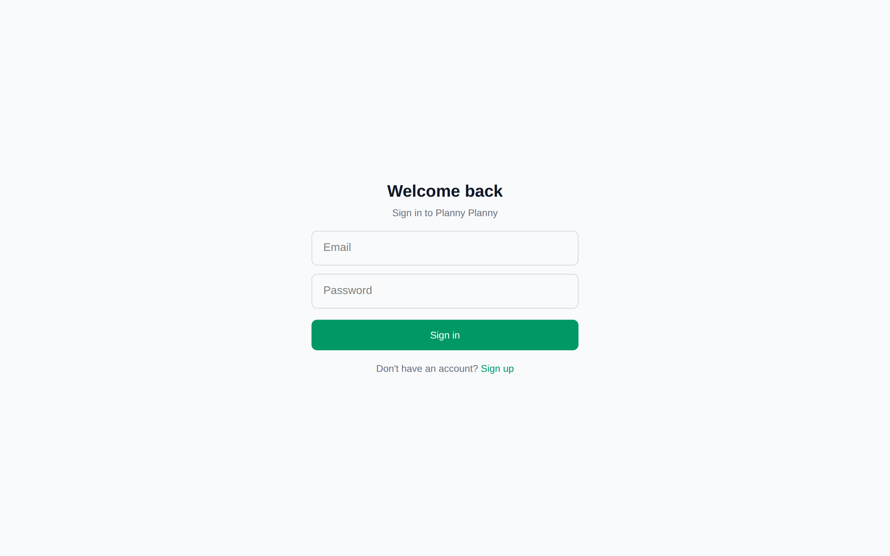
</p>
</details>

---

### 2. Calendar — Perpetual Meal Plan

The main view is a perpetual scrolling calendar starting from today. Each day shows:
- **Who's eating** — the number of adults 👨 and children 👧 (from household defaults + any visitors)
- **Day theme** — recurring placeholders like "🐟 Oily fish day" or "🍖 Sunday roast"
- **Meals** — each meal shows its title, description, and tagged ingredients as coloured pills
- **⭐ Starred ingredients** — highlighted with a star to encourage variety
- **⚠️ Warning ingredients** — flagged when overused (e.g. Chicken)

Tap **+ Add meal** on any day to plan a new meal.

<p align="center">
  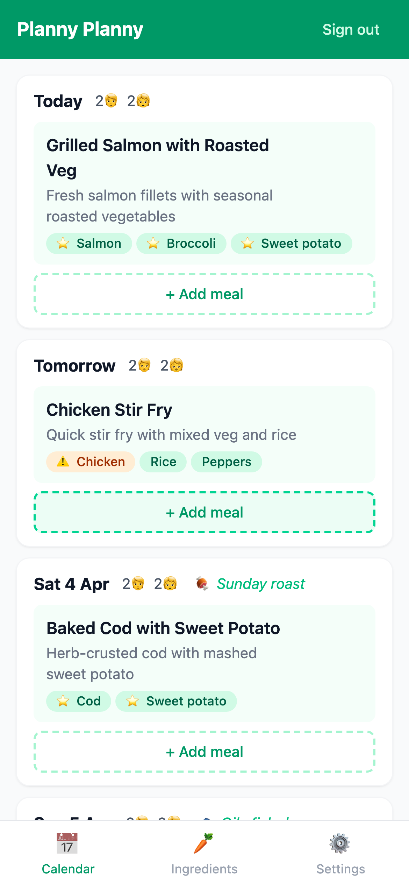
  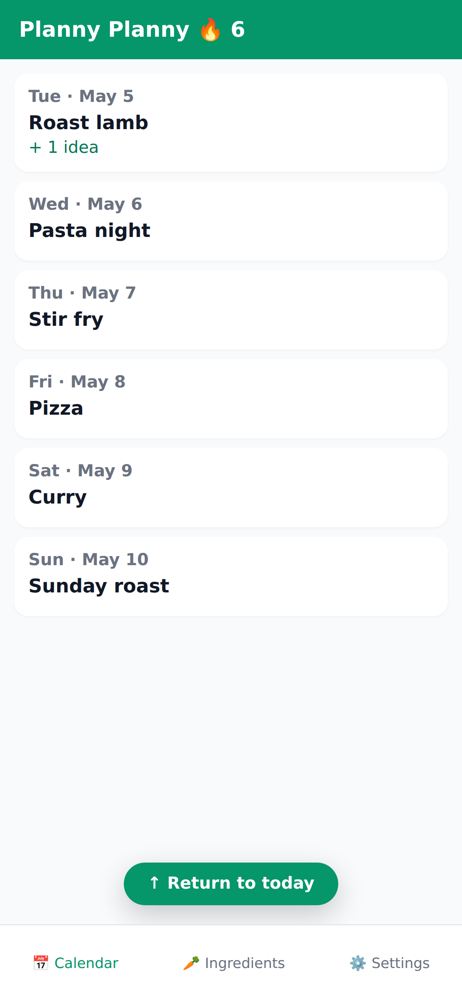
  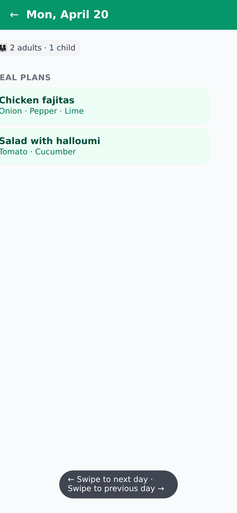
</p>

Scroll position is remembered when you tap into a day and come back, so a long planning session doesn't whisk you back to today every time. Once you've scrolled far enough into the future, a **Return to today** button appears at the bottom — tap it to spring back to the top. On the day view itself, swipe left/right to move between days; swiping a meal card scrolls between meals on the same day.

<details>
<summary>Desktop view</summary>
<p align="center">
  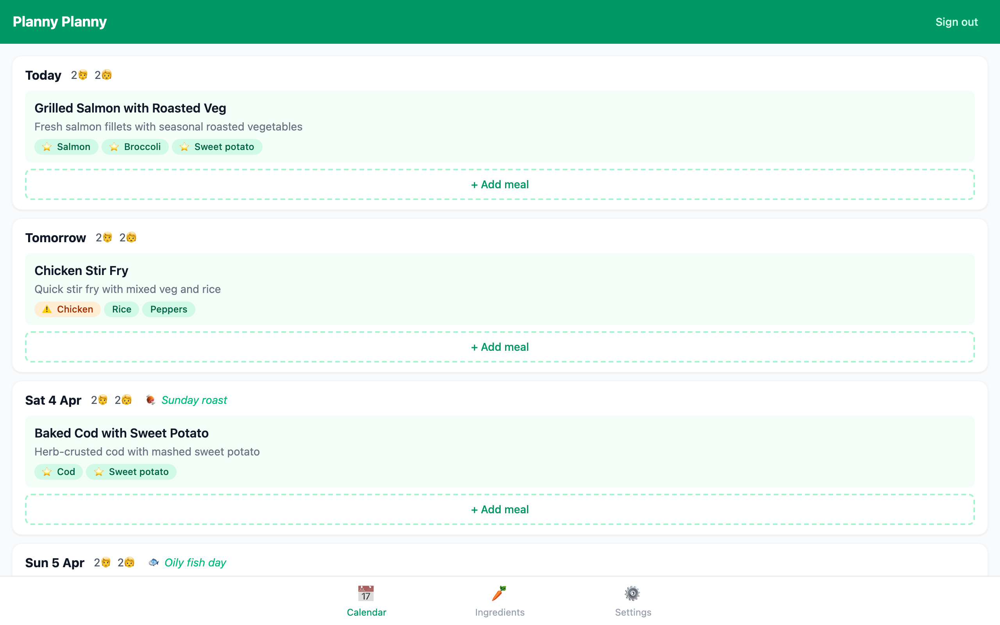
</p>
</details>

---

### 2b. Day Ideas, Meals & Reactions

Inside day detail, ideas are listed between events and meal plans. Both ideas and meal plans expose a **reusable reaction button**:
- **Unreacted** state: greyscale fill with a dashed border — an obvious "tap to react" affordance.
- **Reacted** state: filled indigo with a solid border and bold count.
- **Tap**: instantly likes (or unlikes if you already reacted). If a reaction kind has multiple emoji options, a small inline picker opens instead.
- **Long press** (500 ms): opens a tray listing who reacted and with which emoji.

Currently only 👍 is wired up, but the component is generic and ready for more reactions.

<p align="center">
  
</p>

<p align="center">
  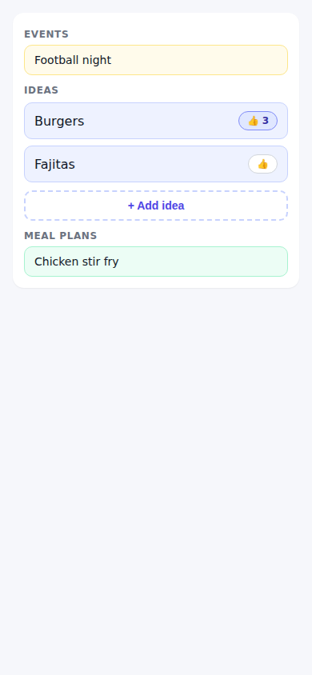
  &nbsp;&nbsp;
  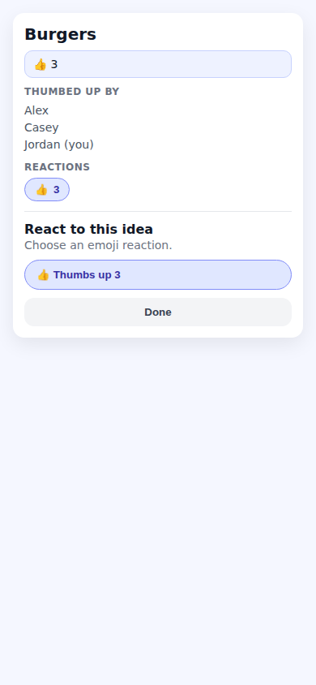
</p>

---

### 3. Ingredients — Track & Balance Your Diet

The Ingredients tab shows your household's full ingredient library with:
- **Usage stats** — how many times each ingredient has been planned and when it was last used
- **⭐ Star** ingredients you want to use regularly (they'll appear in suggestions)
- **⚠️ Warning** flag for ingredients you tend to overuse
- **Sort** by A–Z, most used, or least recently planned
- **Search** to quickly find any ingredient

<p align="center">
  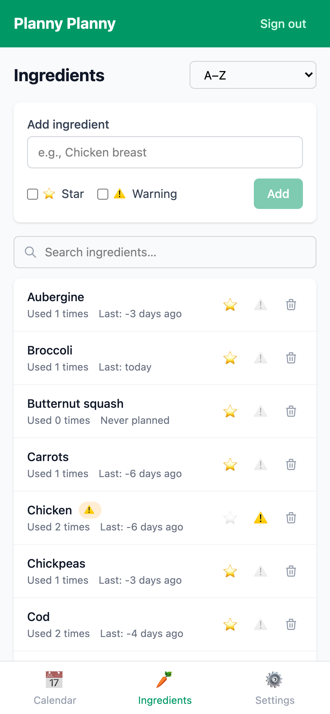
</p>

<details>
<summary>Desktop view</summary>
<p align="center">
  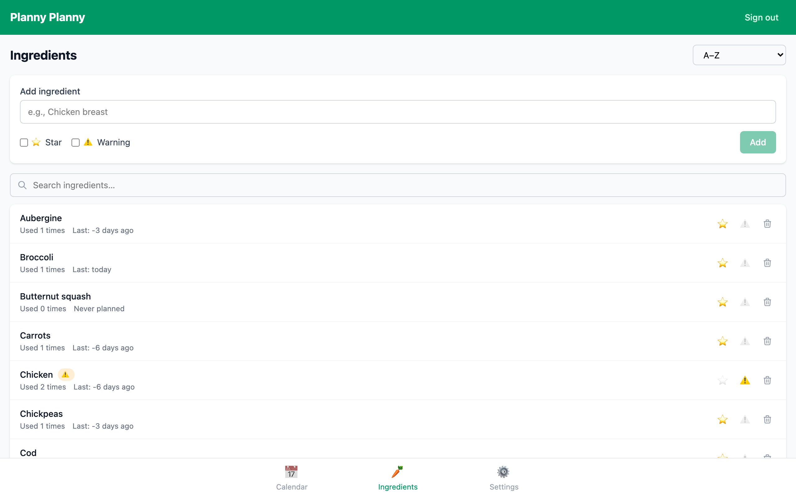
</p>
</details>

---

### 4. Settings — Household Configuration

The Settings tab lets you manage your household:
- **Switch households** — if you belong to multiple households
- **Household settings** — name, alias (e.g. your address), default adults & children
- **Day placeholders** — set recurring themes for each day of the week
- **Members** — view household members and their roles (owner/member/guest)
- **Invites** — generate invite links for new members or guests
- **Public sharing** — toggle a read-only public link for visiting family

<p align="center">
  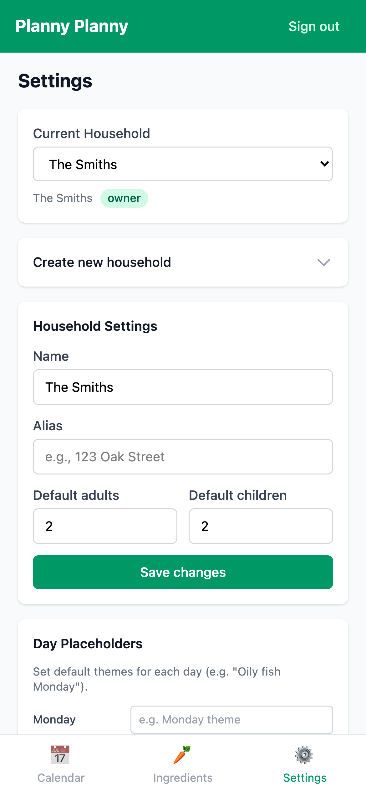
</p>

<details>
<summary>Desktop view</summary>
<p align="center">
  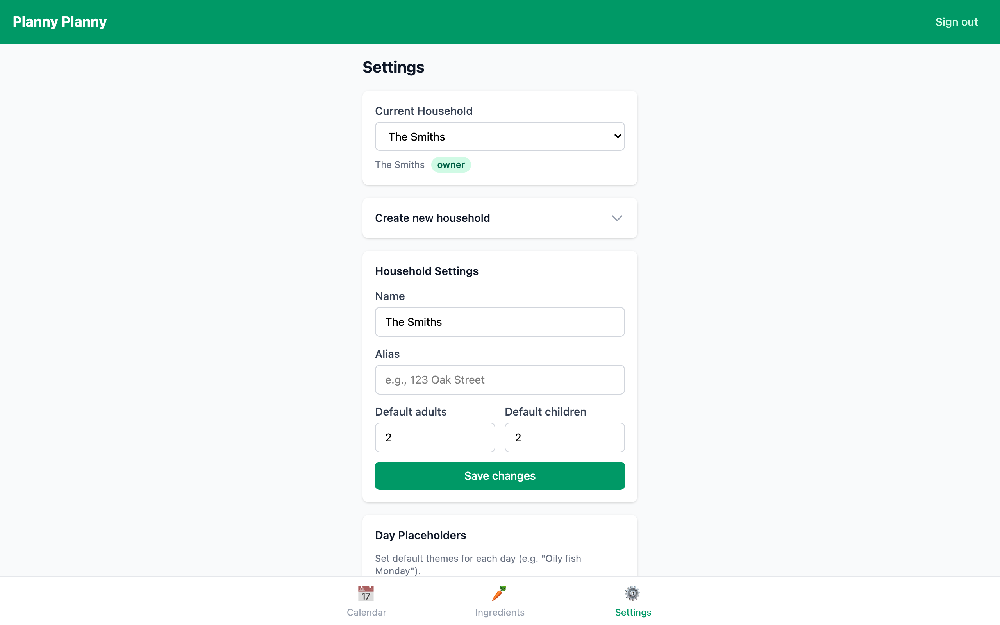
</p>
</details>

## 🚀 Getting Started

### Prerequisites

- [Node.js](https://nodejs.org/) v24 LTS
- [Docker](https://www.docker.com/) (for local Supabase)
- [Supabase CLI](https://supabase.com/docs/guides/cli)

### Local Development

1. **Clone the repository:**
   ```bash
   git clone https://github.com/your-username/planny-planny.git
   cd planny-planny
   ```

2. **Install dependencies:**
   ```bash
   npm install
   ```

3. **Start Supabase locally:**
   ```bash
   npx supabase start
   ```
   This starts a local Supabase instance with Postgres, Auth, Realtime, and more.

4. **Copy environment variables:**
   ```bash
   cp .env.example .env
   ```
   The default values in `.env.example` work with the local Supabase instance.

5. **Apply database migrations:**
   ```bash
   npx supabase db reset
   ```

6. **Start the dev server:**
   ```bash
   npm run dev
   ```
   Open [http://localhost:5173](http://localhost:5173) in your browser.

### Running Tests

```bash
# Run unit tests (Vitest)
npm test

# Run unit tests in watch mode
npm run test:watch

# Run BDD tests (full suite — needs `supabase start`)
npm run test:e2e

# Run only the component BDD suite (in-step HTML harnesses, no Supabase)
npm run test:component

# Run only the integration BDD suite (real app + local Supabase)
npm run test:integration

# Run BDD tests with the Playwright UI
npm run test:e2e:ui
```

For a deep dive into how the BDD suite works — the two suites (real-app
**integration** vs. in-step HTML **component** harnesses), what each one
guarantees, and how to add a new test — see [`docs/bdd-testing.md`](docs/bdd-testing.md).

For how loading states are structured (shared skeleton building blocks +
per-page composition + `AnimatePresence` cross-fade), see
[`docs/skeleton-strategy.md`](docs/skeleton-strategy.md).

## 🌍 Deployment

### How It Works

When you merge to `main`, GitHub Actions automatically:
1. **Pushes database migrations** to your hosted Supabase project
2. **Builds the frontend** with your Supabase credentials baked in
3. **Deploys to GitHub Pages**

No local Supabase CLI installation is needed — everything runs in CI.

### First-Time Setup

#### 1. Create a Supabase project

Go to [supabase.com](https://supabase.com) and create a new project. Note your **project ref** (in Project Settings → General).

#### 2. Generate a Supabase access token

Go to [supabase.com/dashboard/account/tokens](https://supabase.com/dashboard/account/tokens) and create a personal access token.

#### 3. Set GitHub repository secrets

In your GitHub repo → Settings → Secrets and variables → Actions → **Secrets**, add:

| Secret | Value | Where to find |
|--------|-------|---------------|
| `SUPABASE_ACCESS_TOKEN` | Personal access token | [Account tokens page](https://supabase.com/dashboard/account/tokens) |
| `SUPABASE_DB_PASSWORD` | Database password | Project Settings → Database |

#### 4. Set GitHub repository variables

In your GitHub repo → Settings → Secrets and variables → Actions → **Variables**, add:

| Variable | Value | Where to find |
|----------|-------|---------------|
| `SUPABASE_PROJECT_REF` | Your project ref (e.g. `abcdefghijklmnop`) | Project Settings → General |
| `VITE_SUPABASE_URL` | `https://YOUR_PROJECT_REF.supabase.co` | Project Settings → API |
| `VITE_SUPABASE_ANON_KEY` | Your anon/public key | Project Settings → API |

#### 5. Configure Supabase Auth

In your Supabase Dashboard → Authentication → URL Configuration:

- **Site URL**: `https://YOUR_USERNAME.github.io/planny-planny/`
- **Redirect URLs**: Add `https://YOUR_USERNAME.github.io/planny-planny/**`

#### 6. Deploy

Either push a commit to `main`, or go to Actions → "Deploy to GitHub Pages & Supabase" → Run workflow (manual trigger).

The workflow will push all database migrations and deploy the frontend. Subsequent merges to `main` will automatically deploy any new migrations and frontend changes.

## 🏛️ Architecture

### Realtime-First

After authentication, all data flows through Supabase Realtime (WebSockets). When any household member makes a change — to the calendar, ingredients, or settings — it's pushed instantly to all connected members.

- **Writes**: REST API → Postgres (with Row-Level Security)
- **Reads**: Initial REST load, then WebSocket push for all changes
- **Auth**: The only REST-only flow (tokens must exist before WebSocket connects)

### State Management

Server state is owned by Postgres and cached in TanStack Query, kept fresh by
Supabase Realtime. Selected mutations (reactions, todo tick / un-tick) use
optimistic updates so high-frequency taps feel instant. UI / session state
lives in a small set of focused React Contexts (auth, household, overlay,
toast, header override, calendar direction). There is intentionally **no
global state library** — see [`docs/state-management.md`](docs/state-management.md)
for the full review and the rationale, and
[`docs/walkthrough.md`](docs/walkthrough.md) for a friendly tour of the
codebase aimed at developers new to TypeScript or Supabase.

### Database

12 tables with Row-Level Security:
- `profiles` — User display info
- `households` — Household settings and defaults
- `household_members` — User ↔ household membership with roles
- `household_invites` — Token-based invite links
- `meal_plans` — Daily meal entries
- `meal_ideas` — Lightweight daily idea entries
- `todo_items` — Daily todo / reminder items, household or private. Tap one to open a full-screen Todo view (rename, reschedule, attach a note, delete)
- `meal_plan_ingredients` — Ingredients tagged to meals
- `reactions` — Generic emoji reactions across household-scoped entities
- `ingredients` — Household ingredient library
- `day_placeholders` — Weekly recurring labels
- `day_contexts` — Per-day events and visitor overrides

### Roles

Five access levels, summarised below. The full breakdown — what each level
can and can't do, the TypeScript predicates, and the matching RLS policies —
is in [`docs/permissions.md`](docs/permissions.md). Anyone who was previously
a "guest" has been migrated to **Honoured Guest**.

| Role           | View | Edit Meals | Vote | Propose Ideas | Invite | Manage Members |
| -------------- | :--: | :--------: | :--: | :-----------: | :----: | :------------: |
| Owner          |  ✅  |     ✅     |  ✅  |       ✅      |   ✅   |       ✅       |
| Member         |  ✅  |     ✅     |  ✅  |       ✅      |   ✅   |       ❌       |
| Honoured Guest |  ✅  |     ✅     |  ✅  |       ✅      |   ❌   |       ❌       |
| Voting Guest   |  ✅  |     ❌     |  ✅  |       ❌      |   ❌   |       ❌       |
| Public Link    |  partial (meals + ideas + vote counts only) |     ❌     |  ❌  |       ❌      |   ❌   |       ❌       |

Owners can change a member's role by tapping them in the Members card —
that opens the access-level tray with a card per level so you can pick the
new one.

## 📁 Project Structure

```
src/
├── App.tsx                              # Router and provider setup
├── main.tsx                             # Entry point
├── index.css                            # Tailwind imports
├── types/
│   └── database.ts                      # Supabase generated types
├── lib/
│   ├── supabase.ts                      # Supabase client
│   ├── realtime.ts                      # Realtime subscription manager
│   ├── queryKeys.ts                     # Canonical query keys + invalidation graph
│   └── permissions.ts                   # Role predicates
├── hooks/
│   ├── useAuth.tsx                       # Auth context and provider
│   ├── useHousehold.tsx                  # Composes membership, selection, realtime
│   ├── useMemberships.ts                 # Pure membership query
│   ├── useHouseholdRealtime.ts           # Owns the realtime subscription lifecycle
│   ├── useMealPlans.ts                   # Meal plan, day context, placeholder queries
│   ├── useMealIdeas.ts                   # Meal ideas and (optimistic) reaction queries
│   ├── useTodos.ts                       # Todo queries with optimistic complete/reopen
│   ├── useIngredients.ts                 # Ingredient CRUD queries
│   └── useDayPlaceholders.ts             # Day placeholder queries
├── components/
│   ├── auth/
│   │   ├── LoginForm.tsx
│   │   └── RegisterForm.tsx
│   ├── calendar/
│   │   ├── CalendarView.tsx              # Infinite-scroll perpetual calendar
│   │   ├── DayRow.tsx                    # Single day with meals and context
│   │   ├── MealCard.tsx                  # Meal display with ingredients
│   │   ├── MealPlanForm.tsx              # Add/edit meal form
│   │   ├── DayContextForm.tsx            # Add visitors/events to a day
│   │   └── DayContextBadge.tsx           # Visitor/event badge display
│   ├── ingredients/
│   │   ├── AddIngredientForm.tsx          # New ingredient input
│   │   ├── IngredientsList.tsx            # Sortable, searchable ingredient list
│   │   ├── IngredientSuggestions.tsx       # Autocomplete suggestions
│   │   └── IngredientTag.tsx              # Ingredient chip with warning badge
│   ├── layout/
│   │   ├── AppShell.tsx                   # Main app layout wrapper
│   │   ├── ProtectedRoute.tsx             # Auth guard
│   │   └── TabBar.tsx                     # Bottom tab navigation
│   └── settings/
│       ├── HouseholdSwitcher.tsx           # Household dropdown
│       ├── CreateHouseholdForm.tsx         # New household form
│       ├── HouseholdSettings.tsx           # Edit household details
│       ├── DayPlaceholders.tsx             # Weekly day themes
│       ├── MemberList.tsx                  # Household member list
│       ├── InviteManager.tsx               # Create/manage invite links
│       ├── PublicShareToggle.tsx           # Public sharing toggle
│       └── RoleBadge.tsx                  # Owner/member/guest badge
└── pages/
    ├── CalendarPage.tsx                   # Main calendar view
    ├── IngredientsPage.tsx                # Ingredient management
    ├── SettingsPage.tsx                   # Household and account settings
    ├── LoginPage.tsx                      # Login screen
    ├── RegisterPage.tsx                   # Registration screen
    ├── JoinInvitePage.tsx                 # Accept household invite
    └── PublicHouseholdPage.tsx            # Public read-only meal plan
```

## 📄 License

MIT
