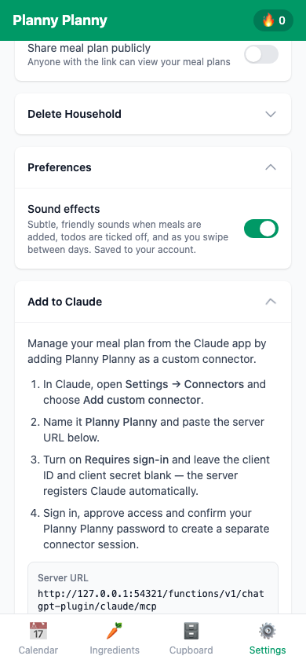

# !AddToClaude

Reusable UI documentation for **!AddToClaude**.

## Purpose and value

This settings card gives Claude users the dedicated
`/chatgpt-plugin/claude/mcp` connector URL and the exact dynamic-registration
steps. The separate URL keeps Claude's temporary OAuth compatibility bridge
isolated from the published ChatGPT plugin.

## Source and lookup

- [Authoritative source: `AddToClaude.tsx`](../../src/components/settings/AddToClaude.tsx)
- [Search all `!AddToClaude` references](https://github.com/colinccook/planny-planny/search?q=!AddToClaude&type=code)
- [Find tests that render or drive it](https://github.com/colinccook/planny-planny/search?q=!AddToClaude+repo%3Acolinccook%2Fplanny-planny&type=code)
- [Canonical !UiComponents index](../ui-components.md)

## Dependencies

- `import { useState } from 'react'`
- `import { copyToClipboard } from '../../lib/clipboard'`
- `import { buildClaudeMcpServerUrl } from '../../lib/mcpUrl'`
- `import { useToast } from '../../hooks/useToast'`
- `import CollapsibleSection from '../ui/CollapsibleSection'`

## Public API

The public API is the exported TypeScript surface; prefer the typed props and callbacks in the source over reaching into implementation details.

- `export default function AddToClaude() {`

## States and visual walkthrough

Document screenshots for each state that users can encounter. Capture at 390×844 and store them under `docs/screenshots/components/add-to-claude/`.

| State | Suggested filename | What to show |
| --- | --- | --- |
| Default | `01-default.png` | Initial usable state |
| Loading or empty | `02-loading-or-empty.png` | Waiting or no-data state, when applicable |
| Active / focused | `03-active.png` | The primary interaction in progress |
| Error / disabled | `04-error-or-disabled.png` | Validation, failure, or permission state |
| Completed | `05-complete.png` | Result after the interaction |

Playwright tests can create these documentation snapshots with `await page.screenshot({ path: 'docs/screenshots/components/add-to-claude/03-active.png', fullPage: true })`. Keep the test setup deterministic, avoid credentials in screenshots, and update images when the observable states change.

Current mobile view:

## Consumption notes

Use the component through its exported API and keep data fetching, mutations, and permissions in the surrounding hook/service layer. Follow the existing component tests for required providers, fixture data, and observable interaction names.

## Maintenance

Update this page, API notes, screenshots, and test links whenever this component gains a prop, state, dependency, or user-visible behaviour.
