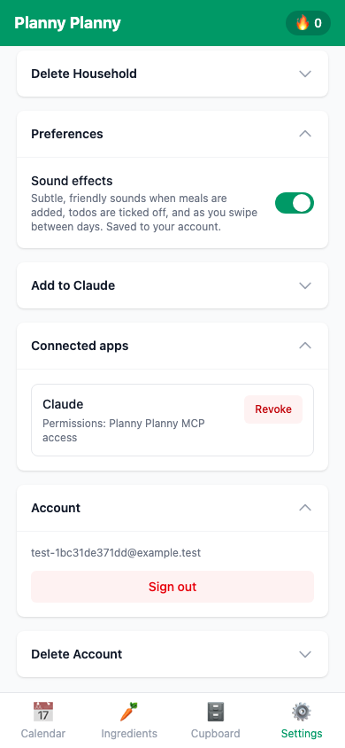

# !ConnectedApps

Reusable UI documentation for **!ConnectedApps**.

## Purpose and value

This component lists both native Supabase OAuth grants (including ChatGPT)
and Claude compatibility grants, and routes revocation through the matching
authorization server so one connection can be removed without affecting the
other or the browser session.

## Source and lookup

- [Authoritative source: `ConnectedApps.tsx`](../../src/components/settings/ConnectedApps.tsx)
- [Search all `!ConnectedApps` references](https://github.com/colinccook/planny-planny/search?q=!ConnectedApps&type=code)
- [Find tests that render or drive it](https://github.com/colinccook/planny-planny/search?q=!ConnectedApps+repo%3Acolinccook%2Fplanny-planny&type=code)
- [Canonical !UiComponents index](../ui-components.md)

## Dependencies

- `import { useConnectedApps } from '../../hooks/useConnectedApps'`
- `import CollapsibleSection from '../ui/CollapsibleSection'`

## Public API

The public API is the exported TypeScript surface; prefer the typed props and callbacks in the source over reaching into implementation details.

- `export default function ConnectedApps() {`

## States and visual walkthrough

Document screenshots for each state that users can encounter. Capture at 390×844 and store them under `docs/screenshots/components/connected-apps/`.

| State | Suggested filename | What to show |
| --- | --- | --- |
| Default | `01-default.png` | Initial usable state |
| Loading or empty | `02-loading-or-empty.png` | Waiting or no-data state, when applicable |
| Active / focused | `03-active.png` | The primary interaction in progress |
| Error / disabled | `04-error-or-disabled.png` | Validation, failure, or permission state |
| Completed | `05-complete.png` | Result after the interaction |

Playwright tests can create these documentation snapshots with `await page.screenshot({ path: 'docs/screenshots/components/connected-apps/03-active.png', fullPage: true })`. Keep the test setup deterministic, avoid credentials in screenshots, and update images when the observable states change.

Current Claude grant:

## Consumption notes

Use the component through its exported API and keep data fetching, mutations, and permissions in the surrounding hook/service layer. Follow the existing component tests for required providers, fixture data, and observable interaction names.

## Maintenance

Update this page, API notes, screenshots, and test links whenever this component gains a prop, state, dependency, or user-visible behaviour.
