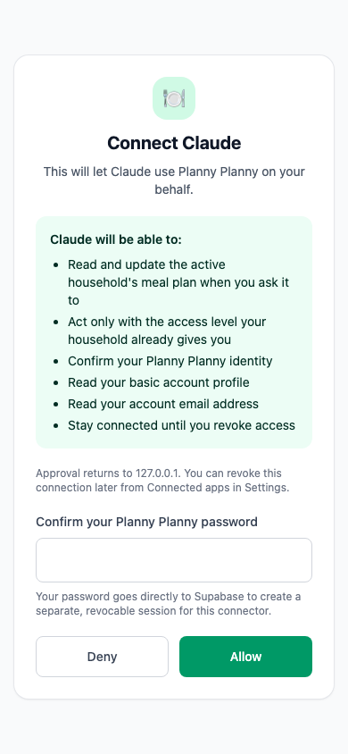

# @ClaudeIntegration

Add Planny Planny to the Claude app as a **custom MCP connector** and
manage your household meal plan by chatting with Claude.

## What it does

- The remote MCP server that powers the [ChatGPT
  plugin](../chatgpt-plugin.md) exposes the same tools through a separate
  Claude **Streamable HTTP** resource with **OAuth 2.1 dynamic client
  registration** — exactly what Claude's *Add custom connector* screen
  expects without changing ChatGPT's published URL or OAuth issuer.
- An **Add to Claude** card on the in-app Settings page walks through
  the setup and offers a one-tap copy of the server URL.
- A mobile approval screen confirms the user's password directly with
  Supabase to create a separate, independently revocable connector session.

## How to connect

1. In Claude, open **Settings → Connectors → Add custom connector**.
2. Name it **Planny Planny** and paste the server URL from the Settings
   card (`https://<api-origin>/functions/v1/chatgpt-plugin/claude/mcp`).
3. Turn on **Requires sign-in**; leave the client ID and client secret
   blank — the server registers Claude automatically.
4. Sign in, approve the connection and confirm your Planny Planny password.
   The password goes directly to Supabase, which creates a separate session
   for Claude rather than sharing the browser session.

Your household permissions still apply to every tool call (RLS plus the
plugin's role checks), and access is revocable from **Connected apps**
in Settings.

ChatGPT continues to use `/chatgpt-plugin/mcp` and native Supabase OAuth.
Claude's compatibility bridge is isolated under `/chatgpt-plugin/claude/mcp`
until [supabase/auth#2820](https://github.com/supabase/auth/issues/2820) is
fixed and verified end to end.

## User journey

1. Open **Settings → Add to Claude** in Planny Planny.
2. Copy the displayed MCP server URL.
3. Add it as a custom connector in Claude and enable sign-in.
4. Complete OAuth approval and password confirmation, then ask Claude to work
   with the household plan.
5. Revoke access later from **Connected apps** when the connector is no longer
   needed.

## Screenshots and visual walkthrough

Capture the entry card, copied-URL state, OAuth approval, successful connector,
and revoked-access state at 390×844 under
`docs/screenshots/claude-integration/`. Playwright can create a deterministic
snapshot with:

```ts
await page.screenshot({
  path: 'docs/screenshots/claude-integration/01-add-to-claude.png',
  fullPage: true,
});
```

Refresh these images whenever the setup journey changes.

Current approval screen:





## Tests

All scenarios for this feature are tagged `@ClaudeIntegration`
([DR-019](../drs/dr-019-feature-tags.md)):

- [Search the repository for `@ClaudeIntegration`](https://github.com/search?q=repo%3Acolinccook%2Fplanny-planny+%22%40ClaudeIntegration%22&type=code)

## Maintenance

Keep this page, its screenshots, and the linked scenarios current when the
connector setup, OAuth flow, or permission behaviour changes.
